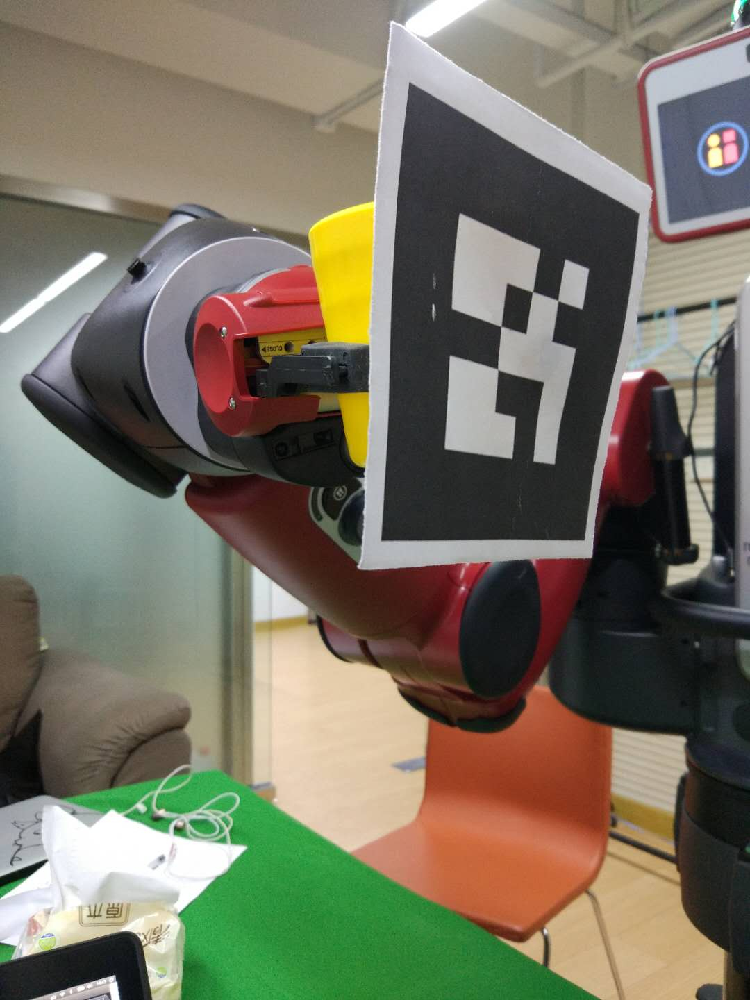

# bar_server

A program to perform the task as a bar waiter.

## Dependency

### Hardware

* Workstatioin with Ubuntu 14.04 and ROS Indigo
* Baxter Research Robot
* Kinect V2 Sensor
* A table, a purple bottle (as whiskey), a orange bottle (as beer) and a yellow cup

### Software

* Baxter SDK
* Kinect V2 driver package: [iai_kinect2](https://github.com/code-iai/iai_kinect2)
* Kinect V2 coordinate calibration package: [kinect_baxter_calibration](https://github.com/ShibataLab/kinect_baxter_calibration)
* Python libraries: Opencv 3, requests, pyaudio

### Installation

* Install ROS Indigo Desktop, Baxter SDK following instrutions given [here](http://sdk.rethinkrobotics.com/wiki/Workstation_Setup).
* Install Kinect V2 driver and ros packages by following the instructions given [here](https://github.com/code-iai/iai_kinect2). Install Packages in the same workspace as Baxter SDK packages.
* Install Kinect V2 coordinate calibration package by following the instructions given [here](https://github.com/ShibataLab/kinect_baxter_calibration).
* Install python dependencies:

```
$ sudo pip install opencv-python pyaudio requests
```

* Check if the version of opencv is correct:

```
$ python
>>> import cv2
>>> cv2.__version__
```

## Preparatory Work

### Kinect2 Intrinsic Calibration

To calibrate color and depth image and align them. Use package kinect2_calibration in iai_kinect2, following the instructions [here](https://github.com/code-iai/iai_kinect2/tree/master/kinect2_calibration). 

Notice: The command given in the instructions is not correct. The correct command is as follows

```
$ rosrun kinect2_calibration kinect2_calibration kinect2 [record/calibrate] [color/ir/sync/depth] chess5x7x0.03
```

### Kinect2 Extrinsic Calibration

To get the transformation of frame from Baxter to Kinect2. Follow the instructions of  package kinect_baxter_calibration [here](https://github.com/ShibataLab/kinect_baxter_calibration). The Least Squares Calibration Method gets the best result.

#### Usage

* Download AR code [here](https://github.com/ros-perception/ar_track_alvar/tree/melodic-devel/ar_track_alvar/markers) and print.
* Set the size of AR code in marker_track.launch. The black margin of AR code should be taken into consideration when measuring the size. Unit is cm.
* Set the id of AR code in marker_track.yaml (usually, the id is 1). Set which arm to use (left or right).
* Stick the AR code to the gripper. Remember to set it in right rotation. (The setting below is not right as the AR code has counterclockwise rotated for about 90 degrees).



* Launch the kinect2 driver

```
$ roslaunch kinect2_bridge kinect2_bridge.launch publish_tf:=true
```

* Open Rviz and add tf, RobotModel and pointcloud2.
* Launch marker_track.launch. Remember to hold the AR code in the sight of kinect2. Then the frame of kinect and AR code with be shown in Rviz.
* Move the arm randomly. Then press ctrl-c to stop the program.
* Launch compute_calibration.launch to calculate the tf, then the calibration data will save in kinect_calibration.yaml. (Notice: If you meet some errors about "axes" and "titleWeight", just delete the related code in compute_calibration.py. )
*  Then launch publish_calibration.launch and you can publish the frame of kinect in ros.

## Usage

* Launch the kinect2 driver

```
$ roslaunch kinect2_bridge kinect2_bridge.launch
```

* Run the jack server

```
$ jack_control start
```

* Run the bar waiter program

```
$ roscd bar_server/scripts
$ python voice_controller.py
```

* Speak your command to microphone in Chinese, like

```
—— 你好
—— 我要一杯威士忌
—— 我要一杯啤酒
—— 再见
```


#### Notice

For the first time you run this programme, you need to publish the frame message of kinect2 and calculate the tf matrix from baxter to kinect2, by

* Publish kinect2's frame in ros

```
$ roslaunch kinect_baxter_calibration publish_calibration.launch
```

* Uncomment the code of line 262 and 263 in bar_server/scripts/cup_detector.py, and comment line 264 to line 268.

```
262	# tf_listener = tf.TransformListener()
263	# self.tf_base2kinect = self.lookupTransform(
		tf.TransformListener(), '/base', 'kinect2_link')
264	self.tf_base2kinect = np.array(
265		[[-0.99701393,  0.01709224, -0.07530658,  0.74413355],
266		[ 0.07443345, -0.04698567, -0.99611847,  1.03124663],
267		[-0.02056422, -0.99874932,  0.04557314,  0.19888489],
268		[ 0.        , 0.         , 0.         , 1.        ]])
```

For long-term use, you can just rewrite the tf matrix in line 265 to line 268, and comment line 262 and line 263 again.